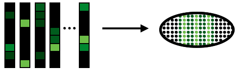

|Docs|

.. |Docs| image:: https://readthedocs.org/projects/novosparc-nukappa/badge/?version=latest
   :target: https://novosparc-nukappa.readthedocs.io/en/latest/

novoSpaRc - *de novo* Spatial Reconstruction of Single-Cell Gene Expression
===========================================================================

``novoSpaRc`` predicts locations of single cells in space by solely using 
single-cell RNA sequencing data. An existing reference database of marker genes
is not required, but significantly enhances performance if available.

It is created and maintained by 
`Nikos Karaiskos <mailto:nikolaos.karaiskos@mdc-berlin.de>`_
and `Mor Nitzan <mailto:mornitzan@fas.harvard.edu>`_, and
accompanies [Nitzan18].

`Read the documentation <https://novosparc-nukappa.readthedocs.io/en/latest/>`_ for more information.
